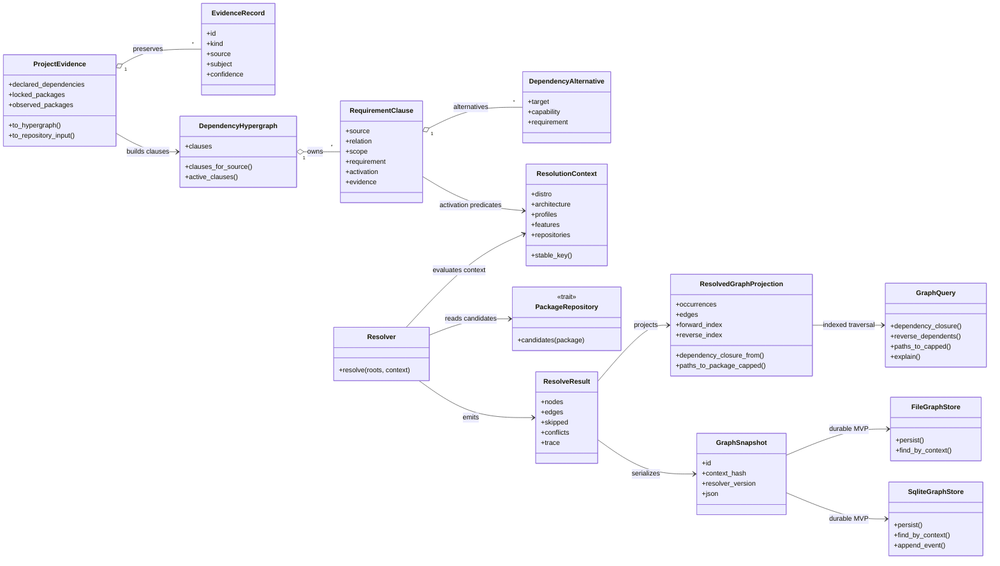
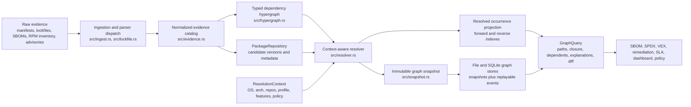
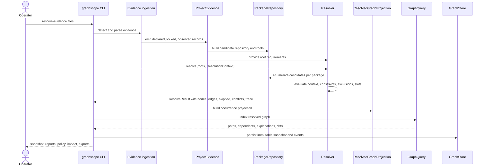

# Architecture UML

GitHub renders Mermaid diagrams in Markdown, so this document uses Mermaid
UML-style class and sequence diagrams instead of external PlantUML assets.

The diagrams show the current GraphScope MVP contract: evidence is preserved,
context determines the valid graph, resolution emits immutable snapshots, and
query/reporting surfaces consume resolved projections.

## Domain Class View

## Runtime Component View

## Resolution Sequence

## Design Reading

The architecture follows these project decisions:

- [Design Decisions](../DECISIONS.md): accepted decisions and tradeoffs.
- [Architecture](architecture.md): production layering and service boundaries.
- [Hypergraph Model](hypergraph-model.md): source-of-truth model and projection
  strategy.
- [Resolution Algorithm](resolution-algorithm.md): resolver control flow,
  explainability, and scale strategy.
- [Capability Matrix](capability-matrix.md): implemented versus planned adapter
  capability.

The research-backed rationale is summarized in
[Modeling And Traversing A Multimodal Dependency Hypergraph](../Modeling_and_Traversing_a_Multimodal_Dependency_Hypergraph.txt):
dependency resolution should preserve unresolved clauses and context first, then
materialize resolved graph projections for traversal and reporting.
