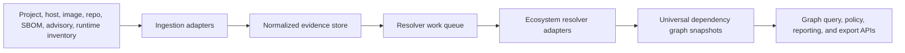

# Architecture

GraphScope is a dependency intelligence platform with three layers:

1. Ingestion captures ecosystem-native evidence.
2. Resolution converts evidence plus context into deterministic graph snapshots.
3. Graph services answer business, security, lifecycle, and customer questions.

## High-Level Flow

## Core Services

### Ingestion API

Accepts source projects, manifests, lockfiles, container images, RPM repositories,
host package inventories, SBOMs, VEX documents, advisories, and runtime package
facts. It records immutable raw evidence and emits normalized evidence events.

The MVP includes parser-level normalized evidence for pip requirements, Go
modules, Cargo.lock, npm package-lock, Maven POM dependencies, Gradle dependency
declarations, and RPM runtime inventories. The `graphscope evidence <path>`
workflow auto-detects those formats and emits a normalized evidence summary.

### Evidence Store

Stores raw input and parsed facts. Raw evidence remains available so every graph
edge can be traced back to a manifest, lockfile, RPM repodata entry, advisory, or
runtime observation.

Recommended production storage:

- object storage for raw artifacts;
- PostgreSQL for evidence metadata, resolver jobs, and customer/product state;
- RocksDB or FoundationDB-style key-value storage for high-volume parsed facts;
- OpenSearch only for search, never as the authoritative graph.

### Resolver Workers

Resolver workers are stateless and horizontally scalable. Each worker receives a
root package/project, a resolver version, and a `ResolutionContext`. It loads
candidate metadata from the evidence store and registry/repository mirrors, then
emits an immutable graph snapshot.

Resolver adapters should exist per package-manager family:

- RPM/DNF/libsolv adapter for AlmaLinux, CloudLinux, ELS, KernelCare, and
  repository-channel context.
- Python adapter for pip, Poetry, PEP 508, wheel tags, and lockfiles.
- Java adapter for Maven and Gradle effective dependency metadata.
- JavaScript adapter for npm package-lock and registry semantics.
- Go adapter for module graph, MVS, replace/exclude, and build tags.
- Cargo adapter for features, target dependencies, patches, and lockfiles.

The Rust implementation in this repository provides the shared model,
context-aware resolver, explainable decision trace, and stable graph snapshot
contract. Production adapters should plug ecosystem-native candidate enumeration
and conflict mediation into the same graph contract.

### Graph Store

The graph store persists immutable resolved snapshots plus indexes for common
queries:

- forward dependencies: application to full transitive dependency tree;
- reverse dependencies: component to all affected applications/products;
- activation context: which environments make an edge true;
- evidence lineage: why this edge exists and where it came from;
- risk overlays: CVEs, errata, ELS state, lifecycle, license, malware, policy;
- diff indexes: graph A versus graph B across distro, architecture, or resolver
  version.

Recommended storage pattern:

- compressed adjacency lists for snapshot traversal;
- columnar edge tables for analytics;
- graph database or graph-query layer for interactive investigations;
- cached closure indexes for high-frequency CVE and advisory impact queries.

The MVP implements this as an in-memory graph store keyed by tenant, product,
and context hash. It is intentionally small, but it exercises the production
contract: stored resolved snapshots can be queried for package reachability,
reverse dependencies, explanations, advisory impact, and invalidation planning.

The durable MVP store persists immutable snapshot JSON files plus a compact
snapshot index through `FileGraphStore` and the `graphscope persist <dir>`
workflow. It also persists replayable invalidation inputs through
`FileChangeEventLog` and the `graphscope events <dir>` workflow so package,
repository, advisory, and policy changes can survive process restarts before
being planned. Production SQLite, RocksDB, event-bus, or columnar adapters
should preserve the same immutable snapshot and ordered event contracts while
adding concurrency, compaction, and analytics indexes.

### Graph Query And Impact API

The MVP graph query layer answers:

- dependency paths from root packages to a selected package;
- reverse dependencies for package impact analysis;
- skipped reasons for inactive dependencies;
- package explanations backed by resolver trace events;
- graph diffs across contexts or resolver versions.

The advisory impact layer matches advisories against selected package versions
and returns affected findings with dependency paths, reverse dependents,
severity, status, and remediation text.

The invalidation planner maps package, advisory, repository-channel, and policy
changes back to impacted tenant/product/context snapshots so resolver work can
be re-run only where the graph might actually change.

### Policy And Reporting API

Serves product workflows:

- "Why is this package present?"
- "Which customers are exposed to CVE-X under CloudLinux 8 with ELS enabled?"
- "Which products break if package Y is removed or rebuilt?"
- "Which runtime dependencies are patched by TuxCare but still appear vulnerable
  in upstream scanners?"
- "Which optional GPU dependencies are active only for x86_64 images?"
- "Which graph changed after a repository update?"
- "Which policy or signature rule blocks this customer graph?"
- "Which snapshots must be recalculated after this policy or advisory change?"

The MVP exposes these workflows through CLI commands and public Rust APIs:
`impact`, `report`, `sbom`, `spdx`, `vex`, `policy`, `sla`, `invalidate`,
`evidence`, `persist`, `events`, `explain`, and `diff`.

## Universal Data Model

### Package

Package identity includes:

- ecosystem;
- namespace/group/module path;
- package name;
- version;
- source repository or registry;
- architecture/platform where relevant;
- source package and build metadata;
- purl and CPE aliases when available;
- checksums and signature state.

### Dependency Edge

An edge includes:

- source package reference;
- target package identity or virtual capability;
- version requirement;
- scope;
- relation type;
- activation predicates;
- resolver rule and selected candidate;
- evidence reference;
- exclusions, replacements, or overrides;
- confidence and freshness metadata.

### Context

Context is not a filter bolted on later. It is part of the graph key.

Minimum production context:

- OS and distribution: AlmaLinux, CloudLinux, RHEL-compatible, container base;
- distro major/minor version;
- architecture: x86_64, aarch64, ppc64le, s390x;
- repository channels and priorities;
- package-manager version and resolver mode;
- language/runtime versions;
- build profile: production, development, test, FIPS, ELS, KernelCare, ELevate;
- enabled extras, features, groups, modules, and build tags;
- customer policy: weak deps, optional deps, mirrors, allow/deny registries.

## Scale Strategy

GraphScope should optimize for repeated resolution under similar contexts.

- Canonicalize context into a stable hash.
- Cache registry and repository metadata by ecosystem, channel, architecture, and
  timestamp.
- Use immutable graph snapshot IDs for deduplication.
- Partition resolver work by ecosystem and product/customer ownership.
- Store graph closures for popular roots and advisories.
- Use incremental invalidation when only one repository, advisory, or package
  version changes.
- Treat policy changes as graph-affecting metadata changes because customer
  eligibility, source allowlists, and coverage rules can alter remediation
  obligations without changing package versions.
- Keep resolver traces compact but complete enough for audit.

## Security And Trust

GraphScope is itself supply-chain infrastructure, so it needs strict provenance:

- signed resolver containers and reproducible worker builds;
- read-only registry/repository mirrors for resolution;
- checksum validation for lockfiles and artifacts;
- source allowlists per customer/product context;
- immutable evidence and graph snapshots;
- resolver version recorded on every graph;
- policy separation between internal CloudLinux/TuxCare metadata and customer
  uploaded evidence.

## Availability Model

The graph query API should remain available even when registry mirrors or
resolver workers are degraded. Existing graph snapshots are immutable and can be
served independently. Fresh resolution jobs can queue until mirrors recover.

## Export Model

GraphScope-native graphs are richer than standard SBOM formats. Exports should
be generated as views:

- CycloneDX for customer inventory exchange;
- SPDX for compliance workflows;
- VEX for vulnerability status;
- internal TuxCare impact reports with resolver evidence;
- SLA risk summaries for executive and customer-success workflows;
- customer-facing remediation plans.

No export format should become the internal source of truth.
