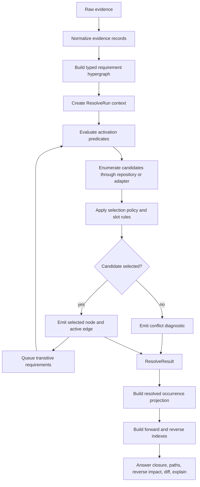
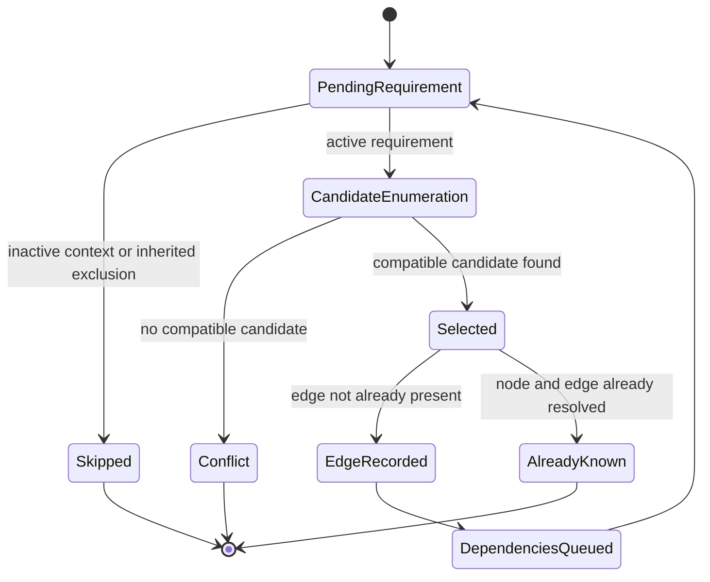
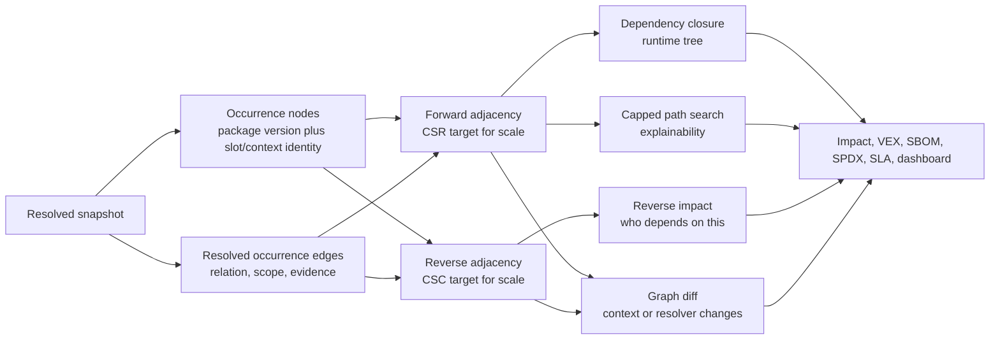

# Graph Algorithms

This document explains the graph algorithms behind GraphScope and separates two
problems that are often conflated:

1. deciding which dependency graph exists for a given resolver context;
2. traversing and indexing the resolved graph that was produced.

The first problem is semantic and package-manager-specific. The second problem is
ordinary graph work once the snapshot is correct.

## Algorithm Pipeline

## Resolution State Machine

The resolver uses a deterministic FIFO queue. Each queued requirement carries the
requester, dependency depth, parent slot, inherited exclusions, and parent trace
event. The resolver records every selected, skipped, and conflicting decision in
the trace.

## Traversal And Index View

## What Is Implemented In The MVP

| Area | Current implementation | Main file |
| --- | --- | --- |
| Evidence normalization | Declared, locked, observed, and SBOM-derived records with stable IDs. | [src/evidence.rs](../src/evidence.rs) |
| Parser dispatch | Auto-detects supported fixtures and runtime inventory inputs. | [src/ingest.rs](../src/ingest.rs) |
| Requirement hypergraph | Clauses, alternatives, activation filtering, and occurrence projection types. | [src/hypergraph.rs](../src/hypergraph.rs) |
| Resolver | FIFO resolution, context activation, constraints, slots, skipped records, conflicts, traces. | [src/resolver.rs](../src/resolver.rs) |
| Query layer | Dependency closure, reverse dependents, capped paths, explanations, diffs. | [src/query.rs](../src/query.rs) |
| Snapshot layer | Stable JSON with nodes, edges, skipped records, conflicts, trace, occurrences. | [src/snapshot.rs](../src/snapshot.rs) |
| Benchmark | Deterministic graph creation and traversal workload. | [src/benchmark.rs](../src/benchmark.rs) |

## Algorithmic Choices

### Hypergraph Before Resolution

A requirement may point to alternatives or capabilities rather than one package.
This is why the unresolved layer is a typed hypergraph. RPM virtual provides,
Python extras, npm peers, Maven exclusions, Gradle variants, Go build tags, and
Cargo features all need to survive normalization.

### Context Before Candidate Selection

Activation predicates are evaluated before candidate selection. This prevents
inactive edges, such as macOS-only dependencies or disabled optional GPU
dependencies, from becoming false runtime dependencies.

### Slots Instead Of One Global Package Key

The resolver uses selection slots. RPM, Python, Maven, Gradle, and Go mostly use
global package slots in the current MVP. npm and Cargo-style ecosystems can use
parent-local slots so parallel versions remain representable.

### Trace Every Decision

Trace events are part of the algorithm, not logging decoration. They let graph
queries explain why a package was selected, skipped, or conflicted.

### Traverse Projections, Not Declarations

After resolution, ordinary graph algorithms are correct again. Forward adjacency
answers dependency closure and path questions. Reverse adjacency answers impact
questions. Capped path search prevents explainability queries from exploding on
dense graphs.

### Index Only What Becomes Hot

The MVP uses adjacency lists. The next scale step is immutable CSR and CSC
snapshot projections. More advanced reachability indexes should be added only
after measuring real query volume.

## Research Mapping

| Research document | What it supports in GraphScope |
| --- | --- |
| [Local synthesis: Modeling And Traversing A Multimodal Dependency Hypergraph](../Modeling_and_Traversing_a_Multimodal_Dependency_Hypergraph.txt) | The core split between deciding which graph exists and traversing the resolved projection. |
| [Hypergraph Model](hypergraph-model.md) | The accepted source-of-truth model: typed context-conditioned hypergraph plus occurrence projections. |
| [Resolution Algorithm](resolution-algorithm.md) | The executable resolver control flow and explainability contract. |
| HyperRes, "Solving Package Management via Hypergraph Dependency Resolution" | Hyperedges model dependencies, optional dependencies, conflicts, architecture, features, and deployment environment. |
| Package Managers a la Carte / Package Calculus | Package-manager semantics share a formal core, but the general problem is harder than plain traversal and can reduce to simpler classes under restrictions. |
| ACM Queue, "The Surprise of Multiple Dependency Graphs" | A package can have many valid dependency graphs depending on resolver, platform, registry state, other dependencies, and time. |
| deps.dev API and BigQuery schema | Requirements and resolved dependencies are separate surfaces; dependents and dependency graph edges are query projections. |
| PEP 508 | Python dependencies include environment markers and extras, so context must be part of dependency truth. |
| Graph reachability indexing survey | Cold traversal can use adjacency lists, while hot reachability queries can use tree cover, 2-hop, labeling, or approximate indexes. |
| FASTEN | Package presence and vulnerable-code reachability are different layers; call-graph overlays belong after package graph correctness. |

## Research References

- HyperRes, "Solving Package Management via Hypergraph Dependency Resolution":
  <https://arxiv.org/abs/2506.10803>
- Package Managers a la Carte / Package Calculus:
  <https://ryan.freumh.org/papers/2026-package-calculus.pdf>
- ACM Queue, "The Surprise of Multiple Dependency Graphs":
  <https://queue.acm.org/detail.cfm?id=3723000>
- deps.dev API:
  <https://docs.deps.dev/api/v3alpha/>
- deps.dev BigQuery schema:
  <https://docs.deps.dev/bigquery/v1/>
- PEP 508:
  <https://peps.python.org/pep-0508/>
- Graph reachability indexing survey:
  <https://arxiv.org/html/2311.03542v2>
- FASTEN:
  <https://github.com/fasten-project/fasten>

## Practical Complexity Notes

- Dependency resolution is not "just DFS". DFS or BFS is correct only after the
  resolver has selected a context-bound snapshot.
- Full transitive closure should not be the default storage model. It is too
  large for broad customer/product portfolios and hard to invalidate.
- SCC condensation, CSR, CSC, O'Reach-style partial indexes, BL/minBL-style
  labels, and DAG compression are scale tools behind the projection contract, not
  replacements for package-manager semantics.
- DNF/libsolv oracle output is the right first production path for RPM fidelity
  because native RPM dependency truth includes capabilities, weak deps,
  repository metadata, module filtering, architecture, and solver policy.

## Benchmark Hook

The `graphscope benchmark [layers width fanout max_paths]` command provides a
deterministic workload for algorithm changes. It measures:

- synthetic repository construction;
- resolver graph creation;
- query index creation;
- dependency closure traversal;
- occurrence projection construction;
- occurrence closure traversal;
- capped package-path enumeration;
- capped occurrence-path enumeration.

Use this benchmark to compare graph algorithm changes. Use native package-manager
oracle tests separately to measure adapter correctness and resolver fidelity.
